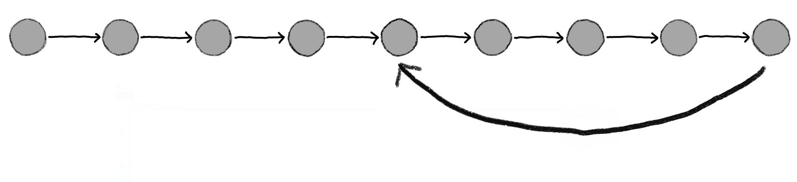

## Why version control?

::: incremental
-   How to keep track of different **file versions**?
    -   `paper-final.qmd` → `paper-final2.qmd` → `paper-final2b.qmd` → 😱
-   How to **collaborate** without overwriting each other's work?
-   How to **go back** to a working state after something breaks?
-   How to know **who changed what and when**?
:::

::: {.fragment}
 . . . 
:::

::: {.fragment}
Solution: **Version control with Git** 
:::

------------------------------------------------------------------------

## "Platform" version control

::: incremental

- MS Word, Google Docs, etc.
- Require a master document
- Often scales poorly (to only a few participants)
- Availablility of complete history questionable
- Stored in some company's cloud
- Works only for specific, often proprietary file types

:::

------------------------------------------------------------------------

## Version control systems

::::::: columns
:::: {.column width="50%"}
{fig-align="center" width="70%"}
::::

:::: {.column width="50%"}
{fig-align="center" width="80%"}
::::
:::::::

------------------------------------------------------------------------

## Version control with Git

::::::: columns
:::: {.column width="70%"}
::: incremental
-   **De facto standard** version control system

-   Can **go back in time** to previous versions

-   Can **track changes** between versions

-   Can **branch and merge**

-   Useful for **collaboration** and **file transfer**

-   **Command line** interface (learning curve)

-   **Graphical interface** in many editors/IDEs (e.g., RStudio, VS Code)

-   **Git** (software) ≠ **GitHub**/**GitLab** (Git repository hosting services)

-   Snapshots enable **persistently archiving** (with DOI) on data repositories (e.g., Zenodo)
:::
::::

:::: {.column width="30%"}
![[<https://git-scm.com/downloads/logos>]{style="font-size:0.6em"}](img/Git-logo.png){fig-align="center" width="150"}

{fig-align="center" width="500"}

::::
:::::::


------------------------------------------------------------------------

## Core Git concepts

| Concept | Description |
|---|---|
| **Repository** | A directory tracked by Git (`.git/` folder inside) |
| **Commit** | A snapshot of changes, with a message and timestamp |
| **Remote** | A version of the repo hosted on a server (GitHub/GitLab) |
| **Clone** | Copying a remote repo locally |
| **Fork** | Creating an independent copy remotely |
| **Push / Pull** | Sending / fetching commits to/from a remote |
| **Branch** | An independent line of development |
| **Merge** | Combining changes from two branches |

------------------------------------------------------------------------

## Common Git operations

![[<https://commons.wikimedia.org/wiki/File:Git_operations.svg>]{style="font-size:0.7em"}](img/Git_operations.png){fig-align="center" }

------------------------------------------------------------------------


## Basic Git workflow

``` bash
# Initialise a new repository
git init

# Check the status of your working directory
git status

# Stage changes for the next commit
git add myfile.qmd

# Commit staged changes with a message
git commit -m "Add introduction section"

# Connect to a remote and push
git remote add origin https://github.com/yourname/yourrepo.git
git push -u origin main
```

------------------------------------------------------------------------

## Git for reproducible research

::: incremental
-   Every commit is a **citable point in time** — link a paper to a specific commit

-   Combine with a **data repository** (e.g., Zenodo) to obtain a DOI for a release

-   Platforms like GitHub and GitLab offer **issue tracking**, **code review**, and **CI/CD**

-   `.gitignore` keeps large or sensitive files out of the repository

-   Good commit messages serve as a **lab notebook**
:::

------------------------------------------------------------------------

## Working with branches

``` bash
# Create and switch to a new branch
git checkout -b feature/new-analysis

# ... make changes and commit ...

# Switch back to main
git checkout main

# Merge your feature branch
git merge feature/new-analysis
```

::: fragment
Branches are cheap and encourage **experimentation without risk**.
:::

------------------------------------------------------------------------

## Tips for a clean Git history

::: incremental
-   Commit **often** and in **logical units** — one concept per commit

-   Write **informative commit messages** ("Add figure 3", not "update manuscript")

-   Avoid tracking large data, generated files, and credentials — **use `.gitignore`**

-   Prefer **topic branches** over committing directly to `main`

-   Include an explanatory **`README.md` file**

-   Tag **releases** that correspond to paper submissions or milestones
:::

------------------------------------------------------------------------

## Typical one-time setup

::: incremental
-   Create a **personal access token** in user settings (with read & write priveleges)

-   **Save** the token (e.g. in a password manager)

-   **Configure your local git** in the Terminal:
    -   `git config --global user.email "you@example.com"`
    -   `git config --global user.name "Your Name"`

-   When asked, fill in the token as `password` 
:::

------------------------------------------------------------------------

## Additional Resources

-   Official Git documentation: <https://git-scm.com/doc>
-   The Turing Way — Version Control: <https://the-turing-way.netlify.app/reproducible-research/vcs>
-   Happy Git with R (Jenny Bryan): <https://happygitwithr.com>
-   GitHub Skills interactive courses: <https://skills.github.com>
-   CRS workshop materials: <https://crsuzh.pages.uzh.ch/workshop-quarto-2025-unige/>

------------------------------------------------------------------------

## References {.smaller}
