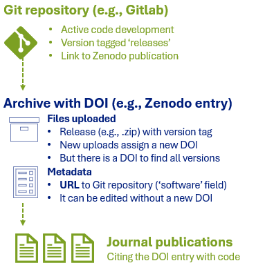
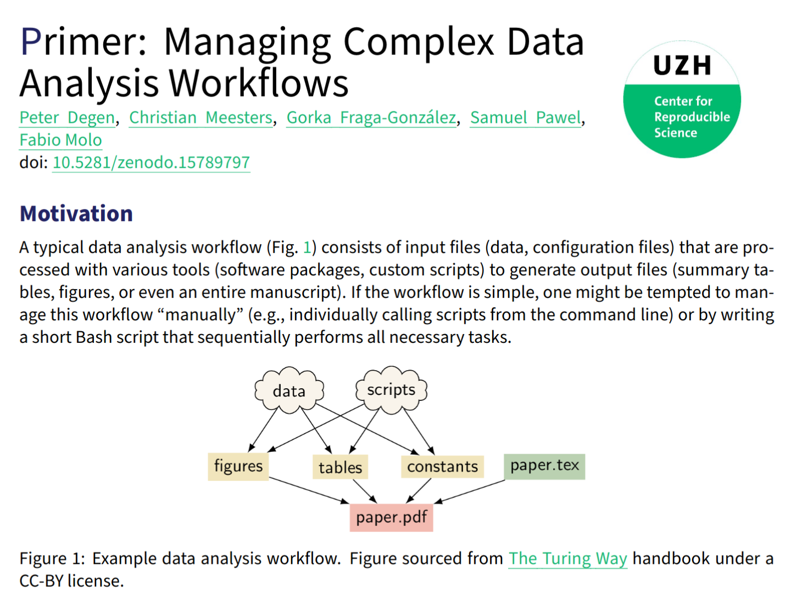
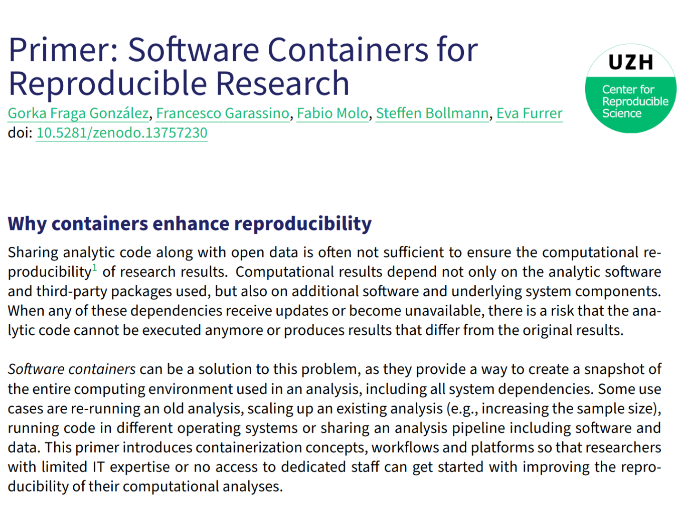

## Sharing scenarios

```{=html}
<style> .font-small {  font-size: 0.8em;} </style>
```

These are some frequent use cases:

1.  `Preliminary results` (temporary, internal reports)
2.  `Internal monitoring` (regularly updated reports)
3.  `Templates or documentation`
4.  `Dissemination` to broader audiences
5.  `Publication` (preprint, dataset, article, etc)

## Git version-controlled repositories

-   [Git](https://git-scm.com/): free and open source distributed version control system
-   Popular platforms: [GitLab](https://gitlab.com/) (open) and [GitHub](https://github.com/) (Microsoft)
-   There are `GitLab instances` at many universities
-   Meant for code and documents, not as data repositories
-   Recommended for `all` sharing scenarios

## Sharing with GitLab pages

-   [Quarto websites](https://quarto.org/docs/websites/) can easily assemble HTMLs in a website
-   [GitLab pages](https://docs.gitlab.com/ee/user/project/pages/) can host multiple `static` websites for free
-   They can be `private` or `public`
-   HTML interactivity: e.g., `dashboards`, `plotly`, `DataTables`
-   Example use-cases: sharing results, technical documentation, templates, dissemination, etc.

------------------------------------------------------------------------

## Persistent identification

A persistent identifier (e.g., DOI) enable our reports to be `reused` and `found` in time.

Required to make our resources `citable`

#### Where can I get a DOI ?

-   Data repositories (e.g., Zenodo, OSF, Ebrains...)
-   Journals and preprint platforms

------------------------------------------------------------------------

### Popular generalist DOI-enabling repositories

::: fragment
#### [Zenodo](https://zenodo.org/)

-   Free. 50 GB upload limit per dataset (up to 200Gb upon request).
-   Hosted by CERN. The data stays in Europe.
:::

::: fragment
#### [Open Science Framework (OSF)](https://osf.io/)

-   Free. Private projects limited to 5 GB and public projects to 50 GB.
-   Default storage location in US, but also servers in Canada, Germany and Australia.
:::

------------------------------------------------------------------------

## Git repositories and DOIs

-   GitLab and GitHub do not offer DOIs
-   'Persistent URLs'/'Permanent links' not as strongly persistent
-   But we can combine a [GitLab releases](https://docs.gitlab.com/ee/user/project/releases/) with DOI enabling platforms
-   A `release` in GitLab is a `snapshot` of a repository with
    -   Version tag
    -   Source code and metadata

------------------------------------------------------------------------

### Workflow example with GitLab and Zenodo {.nostretch}

[Robustness check](https://www.nature.com/articles/s41562-024-01818-7) for Nature Human Behaviour

##### [GitLab Repository](https://gitlab.uzh.ch/crsuzh/nhb-replication)

::: {.column width="50%"}
{fig-align="left" width="491"}
:::

:::: {.column width="45%"}
::: font-small
<br> <br>

Each release includes assets (zipped source code) and a .json with the release metadata

The README.md file has a link to the Zenodo entry with a DOI and citation information.
:::
::::

------------------------------------------------------------------------

##### [Zenodo entry](https://zenodo.org/records/13748512)

::: {.column width="50%"}
{width="500px" fig-align="left"}
:::

::: {.column .font-small width="50%"}
<br><br> A citable Zenodo entry with a DOI and the content of the repository release in a .zip file
:::

------------------------------------------------------------------------

### Preregistration in Open Science Framework (OSF)

-   OSF feature to [preregister](https://help.osf.io/article/145-preregistration) your research plan
-   It can be private and released upon project completion
-   OSF [templates](https://help.osf.io/article/229-select-a-registration-template) can help structure your report
-   Enhances visibility, rigor and transparency of your work

------------------------------------------------------------------------

### Publication workflow



------------------------------------------------------------------------

### Checklist for publishing a git repository

::: incremental
-  Add description in README (dates, project ID, funding, affiliations, DOI )
-  If applicable, add the DOI of the publication in the description
-  Create a release lock the version of a repository
-  Rather than cite the URL, assign a DOI to the release, e.g., Zenodo upload
-  Add a license file to explain reusability ( .g., GPL, MIT. Use a template)
-  Indicate where the source data can be found
:::

------------------------------------------------------------------------

## Putting it all together

:::::: columns
::: {.column width="55%"}

:::

:::: {.column width="45%"}
::: fragment
Terminal

``` {.bash style="font-size:0.85em"}
# clone git repository
git clone git@gitlab.uzh.ch:crsuzh/operra-reproducibility.git

# enter project repository
cd operra-reproducibility/content/module_3_workflow_management/demo/snakemake

# run automated analyses
snakemake --cores 1
```

→ `report.html`

[https://gitlab.uzh.ch/crsuzh/operra-reproducibility](https://gitlab.uzh.ch/crsuzh/operra-reproducibility){style="font-size:0.65em"}
:::
::::
::::::


------------------------------------------------------------------------

## Conclusions

-   Dynamic reporting + version control + automation + containerization

    -   improve **reproducibility**, **reuseability**, **collaboration**
    -   lends research more **transparency**, **credibility**

. . .

-   There is a **learning curve** 😨, but ...

    -   start simple and learn **step-by-step** 💡

    -   tools are **constantly evolving** 🚀

    -   invested learning time can **save you time** in the future ⏳

    -   skills are **useful in/outside Academia** 💰 👨‍🔬

------------------------------------------------------------------------

## The Swiss Reproducibility Network Academy

::::: columns
::: {.column width="80%"}
-   **Early career** researchers section of the SwissRN

-   Goal 1: Connect young researchers interested in **reproducibility in Switzerland**

-   Goal 2: Improve reproducibility of research in Switzerland

-   How to join?

    -   young researchers in **Switzerland** (working language: English)
    -   **interest** in improving research and reproducibility
    -   **every field** is welcome (diversity is the key!)

-   More information: <https://www.swissrn.org/contents/academy/>
:::

::: {.column width="20%"}

:::
:::::

------------------------------------------------------------------------

## CRS Primers

:::::: columns
::: {.column width="45%"}

:::

:::: {.column width="45%"}

::::
:::::

------------------------------------------------------------------------

