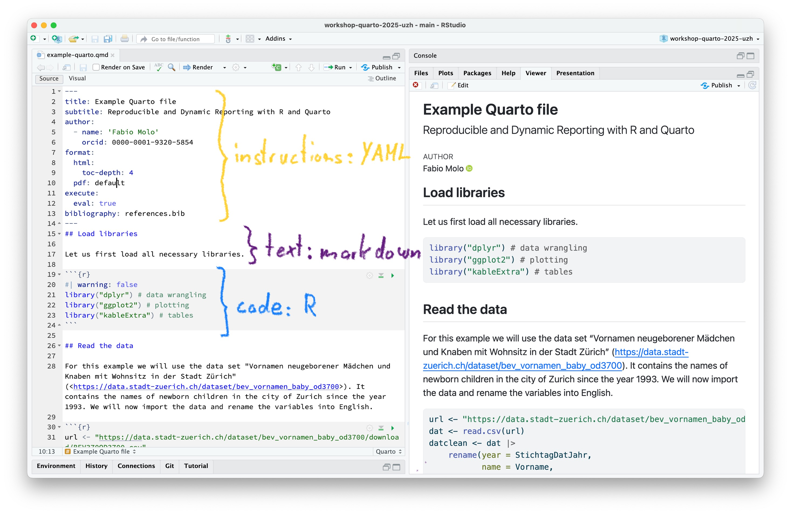
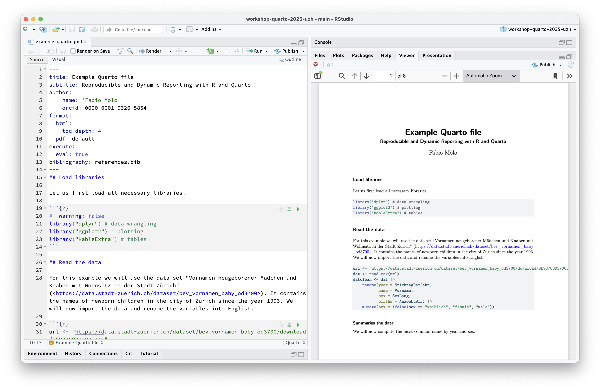
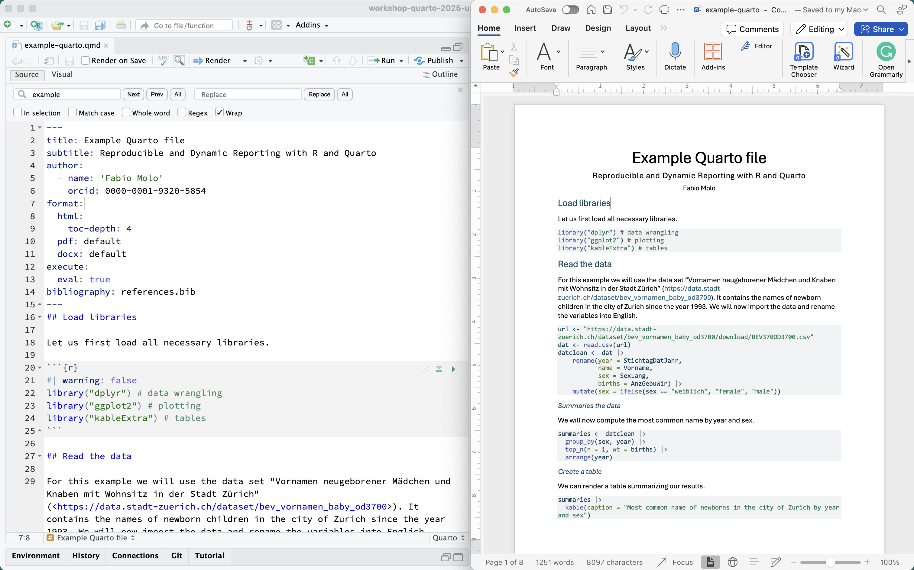

## Computational reproducibility

A (too) simple definition:

[The **same analysis**]{.fragment} [of the **same data**]{.fragment} [produces the **same results**]{.fragment}

:::: incremental

::: fragment
 
Why does it matter?
::: 

::: fragment
Because computational reproducibility
::: 
::: fragment
-   is a marker for careful, rigorous work
-   facilitates re-analysis
-   facilitates re-use of code, methods and data
:::

::: fragment
→ Makes research **more transparent, trustworthy and useful**
:::
::::

------------------------------------------------------------------------

## Example

{fig-align="center" width="75%"}

::: incremental
-   Attempted to rerun **22,578 Jupyter notebooks** associated with 3,467 publications from PubMed
-   For 10,388 of these, all declared dependencies could be installed successfully
-   1,203 notebooks ran through without any errors
-   **879 notebooks (4%)** produced results identical to those reported in the original notebook
:::

------------------------------------------------------------------------

## Structure of this workshop

1.  Introduction -- What is dynamic reporting?

2.  Hands-on -- How can you use it?

3.  Demonstration -- What else is possible?

------------------------------------------------------------------------

## Context and terminology

 

{fig-align="center" width="75%"}

------------------------------------------------------------------------

## Reproducibility

{.absolute right="0" top="0" height="75"}

------------------------------------------------------------------------

## Replicability: Example

{.absolute right="0" top="0" height="75"}

{fig-align="center" width="640"}

------------------------------------------------------------------------

## Robustness: Example

{.absolute right="0" top="0" height="75"}

::::: {.columns align="center"}
::: {.column width="50%"}

:::

::: {.column width="50%"}
{height="400"}
:::
:::::

------------------------------------------------------------------------

## Generalizability: Example

{.absolute right="0" top="0" height="75"}

{width="60%" fig-align="center"}

{width="40%" fig-align="center"}

------------------------------------------------------------------------

## Threats

:::::: {.columns align="center"}
:::: {.column width="50%"}
::: incremental
-   "Garden of Forking Paths"   @gelman2013
-   "Researcher Degrees of Freedom"   @simmons2011
-   "Selective reporting"   @hoffmann2021
:::
::::

::: {.column width="50%" align="top"}
{width="120%"}
:::
::::::

------------------------------------------------------------------------

## Every step counts

:::::: {.columns align="center"}

::: {.fragment}
:::: {.columns align="center"}
::: {.column width="75%"}
Reproducible research is hard and may feel overwhelming
:::

::: {.column width="25%"}
{height="60%"}
:::
::::
:::

::: {.fragment}
:::: {.columns align="center"}
::: {.column width="75%"}
Do not despair! With every step...

::: incremental
-   you are already **one step ahead**
-   you **already improve** the quality of your research   (and of your life)
-   you learn **broadly applicable technical skills**
:::
:::

::: {.column width="25%"}
::: fragment
{height="60%"}
:::
:::
::::
:::

::::::

------------------------------------------------------------------------

## A non-dynamic reporting workflow

------------------------------------------------------------------------

## Typical problems

:::::: {.columns align="center"}
::: {.column width="40%" align="top"}
{height="400"}
:::

:::: {.column width="60%"}
::: incremental
-   **unclear** execution order

-   **time-consuming** copy-pasting

-   **error-prone** copy-pasting

<!-- -   unclear further processing of images and tables\ -->
:::
::::
::::::

------------------------------------------------------------------------

## Dynamic reporting: The ambition {.center}

[`raw data` $\rightarrow$ dynamic reporting file $\rightarrow$ `manuscript`]{style="font-size: 1.5em;"}

------------------------------------------------------------------------

## A dynamic reporting workflow

------------------------------------------------------------------------

## Components of a dynamic report

------------------------------------------------------------------------

## Text: common markup languages

------------------------------------------------------------------------

## Some implementations - history
 \
 \
 
{width="80%" fig-align="center"}

------------------------------------------------------------------------

## Some implementations
\
\

|   | File | Code | Markup | Output formats |
|---------------|---------------|---------------|---------------|---------------|
| Sweave | .Rnw | R | LaTeX | pdf, tex |
| R Markdown | .Rmd | R | Markdown | pdf, html, tex, docx, pptx |
| Jupyter Notebook | .ipynb | Julia, Python, R | Markdown | pdf, html, tex, py, ... |
| Quarto | .qmd | Julia, Python, R | Markdown | pdf, html, tex, docx, pptx, ... |

: {.striped tbl-colwidths="\[29,10,26,18,38\]"}

------------------------------------------------------------------------

## Why Quarto?
::::: columns
::: {.column width="75%"}

-   **open source**
-   **modern**, with new features being developed
-   **easy-to-use**
-   **multiple programming languages**  (e.g., R, Python, Julia)
-   **multiple editors/IDEs** (e.g., RStudio, VS code)
-   **general-purpose** scientific publishing system (e.g., articles, slides, websites)
:::

::: {.column width="25%"}
![[<https://quarto.org/quarto.png>]{style="font-size:0.6em"}](img/quarto.png)
:::
::::

------------------------------------------------------------------------

## Quarto in RStudio

{fig-align="center" width="85%"}

------------------------------------------------------------------------

## Quarto in RStudio: PDF output

{fig-align="center" width="85%"}

------------------------------------------------------------------------

## Quarto in RStudio: MS Word output

{fig-align="center" width="85%"}

------------------------------------------------------------------------

## Quarto -- where to start?

1.  Install Quarto (<https://quarto.org/docs/get-started/>)

2.  Set up a minimal Quarto workflow for one of your projects

3.  Document your steps, read guides, ask for help

4. Live a dynamic and reproducible life

------------------------------------------------------------------------

## Additional Resources

-   CRS Primer on dynamic reporting: <https://doi.org/10.5281/zenodo.7565735>\
-   Quarto intro tutorial: <https://quarto.org/docs/get-started/hello/rstudio.html>\
-   Quarto authoring tutorial: <https://quarto.org/docs/get-started/authoring/>\
-   Quarto article layout: <https://quarto.org/docs/authoring/article-layout.html>\
-   R4DS chapter on Quarto: <https://r4ds.hadley.nz/quarto>\
-   Yihui Xie's blog post: [With Quarto coming, is R Markdown going away? No.](https://yihui.org/en/2022/04/quarto-r-markdown/)\
-   Reproducible manuscripts with Quarto: [Slides by Mine Cetinkaya-Rundel](https://mine.quarto.pub/manuscripts-conf23/#/title-slide)\
-   Quarto/RMarkdown -- What's different?: [Slides by Ted Laderas](https://laderast.github.io/qmd_rmd/#/title-slide)

------------------------------------------------------------------------

## The Swiss Reproducibility Network Academy

::::: columns
::: {.column width="80%"}
-   **Early career** researchers section of the Swiss RN

-   Goal 1: Connect young researchers interested in **reproducibility in Switzerland**

-   Goal 2: Improve reproducibility of research in Switzerland

-   How to join?

    -   young researchers in **Switzerland** (working language: English)
    -   **interest** in improving research and reproducibility
    -   **every field** is welcome (diversity is the key!)

-   More information: <https://www.swissrn.org/contents/academy/>
:::

::: {.column width="20%"}

:::
:::::

------------------------------------------------------------------------

## The Center for Reproducible Science

::::: {.columns align="center"}
::: {.column width="50%"}
{height="300"}
:::

::: {.column width="50%" align="top"}
**Research**:

-   Meta-research methods\
-   Design and analysis of replication studies

**Teaching and training**:

-   Good Research Practice courses\
-   [Primers](https://www.crs.uzh.ch/en/resources/CRS-Primers.html) and [Reproducibility Notes](https://www.crs.uzh.ch/en/resources/CRS-Reproducibility-Notes.html)\
-   [ReproducibiliTea](https://www.crs.uzh.ch/en/training/ReproducibiliTea.html) journal club
:::
:::::

------------------------------------------------------------------------

## References {.smaller}
