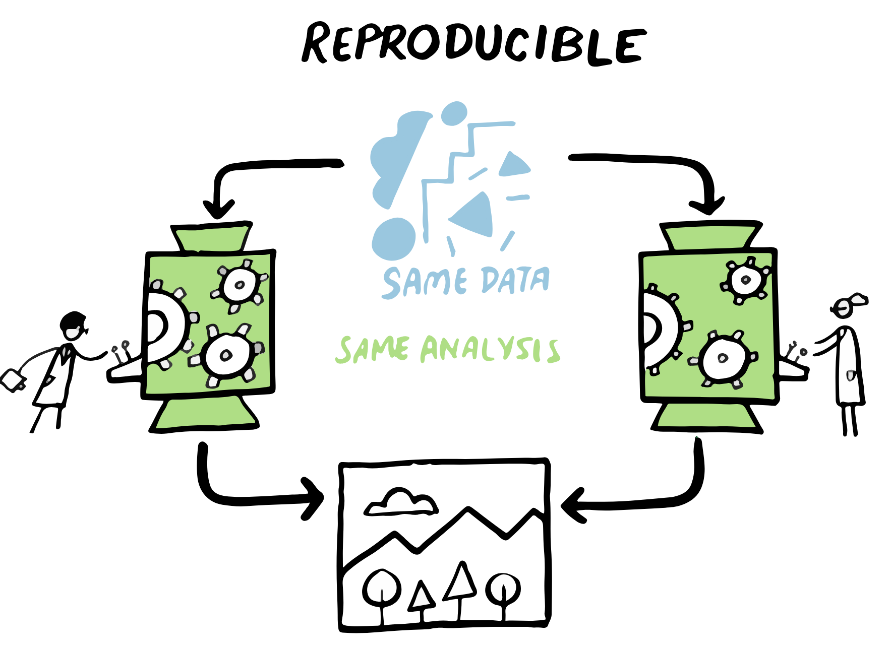
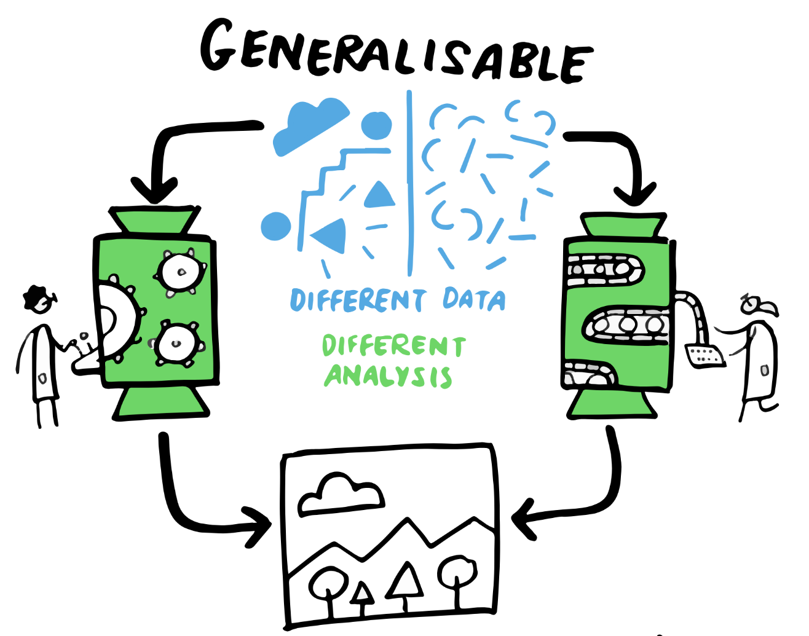
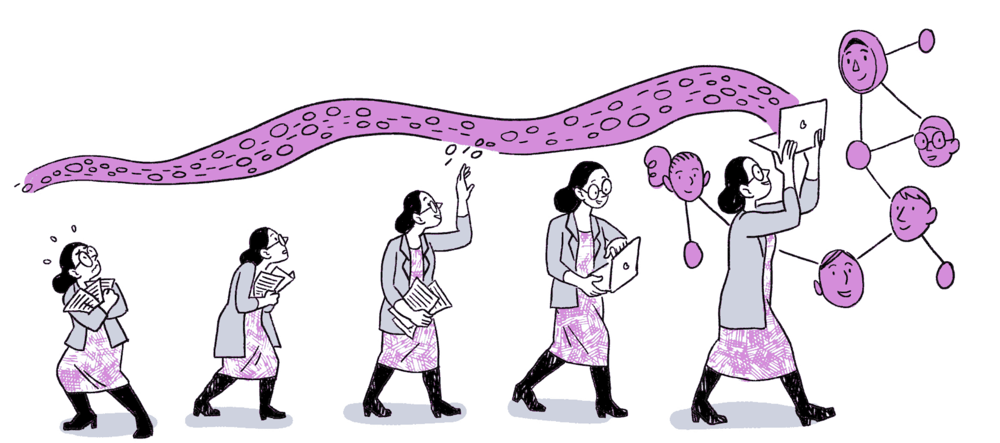

## The Swiss Reproducibility Network Academy

::::: columns
::: {.column width="80%"}
-   **Early career** researchers section of the Swiss RN

-   Goal 1: Connect young researchers interested in **reproducibility in Switzerland**

-   Goal 2: Improve reproducibility of research in Switzerland

-   How to join?

    -   young researchers in **Switzerland** (working language: English)
    -   **interest** in improving research and reproducibility
    -   **every field** is welcome (diversity is the key!)

-   More information: <https://www.swissrn.org/contents/academy/>
:::

::: {.column width="20%"}

:::
:::::

------------------------------------------------------------------------

## The Center for Reproducible Science and Research Synthesis

::::: {.columns align="center"}
::: {.column width="50%"}
{height="250"}

<https://www.crs.uzh.ch>

:::

::: {.column width="50%" align="top"}
**Research**:

-   Evidence synthesis in biomedical research
-   Open research data
-   Methods for replication studies
-   Assessing and improving research  quality

**Teaching and training**:

-   Good Research Practice courses\
-   Educational resources, e.g., [Primers](https://www.crs.uzh.ch/en/resources/CRS-Primers.html)\
-   [ReproducibiliTea](https://www.crs.uzh.ch/en/training/ReproducibiliTea.html) journal club
:::
:::::

------------------------------------------------------------------------

## Computational reproducibility

A (too) simple definition:

[The **same analysis**]{.fragment} [of the **same data**]{.fragment} [produces the **same results**]{.fragment}

\ 

::: fragment
{fig-align="center" width="50%"}
:::
------------------------------------------------------------------------

## Example 1

{fig-align="center" width="70%"}

::: incremental
-   Attempted to rerun **22,578 Jupyter notebooks** from 3,467 PubMed publications 
-   For 10,388 of these, all declared dependencies could be installed successfully
-   1,203 notebooks ran through without any errors
-   **879 notebooks (4%)** produced results identical to those reported in the original
:::

------------------------------------------------------------------------

## Example 2

{fig-align="center" width="70%"}

::: incremental
-   Attempted to rerun **9,000 R files** associated with 2,000 data sets in Harvard Dataverse
-   44% ran through without error when when code cleaning was applied
-   **26% ran through without error**
:::

::: fragment
$\rightarrow$ **Computational reproducibility can be challenging in practice!**
:::
::: fragment
$\rightarrow$ **Code from sharing authors is likely more reproducible!**
:::
------------------------------------------------------------------------

## Structure of this workshop

1.  **Introduction** -- What is dynamic reporting?

2.  **Hands-on** -- How can you use it?

3.  **Sharing and publishing** -- How to share it with others?

4.  **Demonstration of an advanced workflow** -- What else is possible?

::: fragment
Website with all materials: <https://crsuzh.pages.uzh.ch/workshop-quarto-2025-unige/>
:::
------------------------------------------------------------------------

## Context and terminology

 

{fig-align="center" width="75%"}

------------------------------------------------------------------------

## Computational Reproducibility

{.absolute right="0" top="0" height="75"}

------------------------------------------------------------------------

## Replicability: Example

{.absolute right="0" top="0" height="75"}

{fig-align="center" width="640"}

------------------------------------------------------------------------

## Robustness: Example

{.absolute right="0" top="0" height="75"}

::::: {.columns align="center"}
::: {.column width="50%"}

:::

::: {.column width="50%"}
{height="400"}
:::
:::::

------------------------------------------------------------------------

## Generalizability

{.absolute right="0" top="0" height="75"}

 

{fig-align="center" width="50%"}

::: fragment
$\rightarrow$ **Reproducibility + Robustness + Replicability necessary for Generalizabilty!**
:::

------------------------------------------------------------------------

## Every step counts

:::::::::::: {.columns align="center"}
:::::: fragment
::::: {.columns align="center"}
::: {.column width="72%"}
But reproducible research is hard and may feel overwhelming
:::

::: {.column width="28%"}

:::
:::::
::::::

::::::: fragment
:::::: {.columns align="center"}
:::: {.column width="60%"}
Do not despair! With every step...

::: incremental
-   you are already **one step ahead**
-   you **already improve** the quality of your research   (and of your life)
-   you learn **broadly applicable technical skills**
:::
::::

::: {.column width="40%"}
{fig-align="center" width="100%"}
:::
::::::
:::::::
::::::::::::

------------------------------------------------------------------------

## A non-dynamic reporting workflow

------------------------------------------------------------------------

## Typical problems

:::::: {.columns align="center"}
::: {.column width="40%" align="top"}
{height="400"}
:::

:::: {.column width="60%"}
::: incremental
-   **unclear** execution order

-   **time-consuming** copy-pasting

-   **error-prone** copy-pasting

<!-- -   unclear further processing of images and tables\ -->
:::
::::
::::::

------------------------------------------------------------------------

## Dynamic reporting: The ambition {.center}

[`data` $\rightarrow$ dynamic reporting file $\rightarrow$ `manuscript`]{style="font-size: 1.5em;"}

------------------------------------------------------------------------

## A dynamic reporting workflow

------------------------------------------------------------------------

## Components of a dynamic report

------------------------------------------------------------------------

## Text: common markup languages

------------------------------------------------------------------------

## Some implementations - history

\
\

{width="80%" fig-align="center"}

------------------------------------------------------------------------

## Some implementations

\
\

|   | File | Code | Markup | Output formats |
|---------------|---------------|---------------|---------------|---------------|
| Sweave | .Rnw | R | LaTeX | pdf, tex |
| R Markdown | .Rmd | R | Markdown | pdf, html, tex, docx, pptx |
| Jupyter Notebook | .ipynb | Julia, Python, R | Markdown | pdf, html, tex, py, ... |
| Quarto | .qmd | Julia, Python, R | Markdown | pdf, html, tex, docx, pptx, ... |

: {.striped tbl-colwidths="\[29,10,26,18,38\]"}

------------------------------------------------------------------------

## Why Quarto?

::::: columns
::: {.column width="75%"}
-   **open source**
-   **modern**, with new features being developed
-   **easy-to-use**
-   **multiple programming languages** (e.g., R, Python, Julia)
-   **multiple editors/IDEs** (e.g., RStudio, VS Code)
-   **general-purpose** scientific publishing system (e.g., articles, slides, websites)
:::

::: {.column width="25%"}
![[<https://quarto.org/quarto.png>]{style="font-size:0.6em"}](img/quarto.png)
:::
:::::

------------------------------------------------------------------------

## Quarto in RStudio

{fig-align="center" width="82%"}

------------------------------------------------------------------------

## Quarto in RStudio: PDF output

{fig-align="center" width="82%"}

------------------------------------------------------------------------

## Quarto in RStudio: MS Word output

{fig-align="center" width="82%"}

------------------------------------------------------------------------

## Quarto -- where to start?

1.  Install Quarto (<https://quarto.org/docs/get-started/>)

2.  Set up a minimal Quarto workflow for one of your projects

3.  Document your steps, read guides, ask for help

4.  Live a dynamic and reproducible life

------------------------------------------------------------------------

## Additional Resources

-   CRS Primer on dynamic reporting: <https://doi.org/10.5281/zenodo.7565735>\
-   Quarto intro tutorial: <https://quarto.org/docs/get-started/hello/rstudio.html>\
-   Quarto authoring tutorial: <https://quarto.org/docs/get-started/authoring/>\
-   Quarto article layout: <https://quarto.org/docs/authoring/article-layout.html>\
-   R4DS chapter on Quarto: <https://r4ds.hadley.nz/quarto>\
-   Yihui Xie's blog post: [With Quarto coming, is R Markdown going away? No.](https://yihui.org/en/2022/04/quarto-r-markdown/)\
-   Reproducible manuscripts with Quarto: [Slides by Mine Cetinkaya-Rundel](https://mine.quarto.pub/manuscripts-conf23/#/title-slide)\
-   Quarto/RMarkdown -- What's different?: [Slides by Ted Laderas](https://laderast.github.io/qmd_rmd/#/title-slide)

------------------------------------------------------------------------

## References {.smaller}
