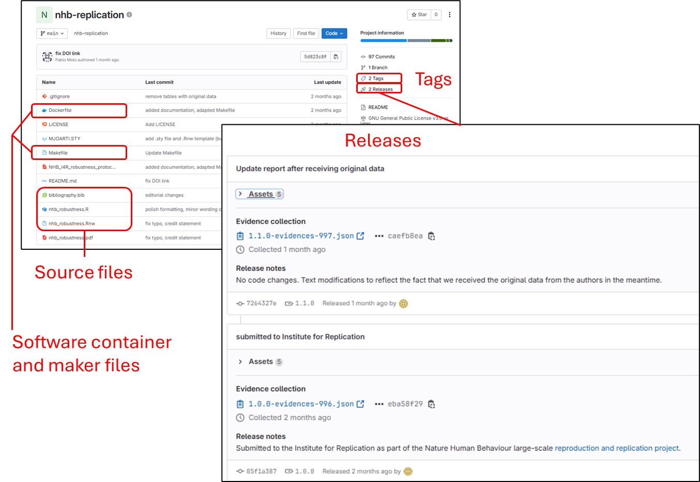
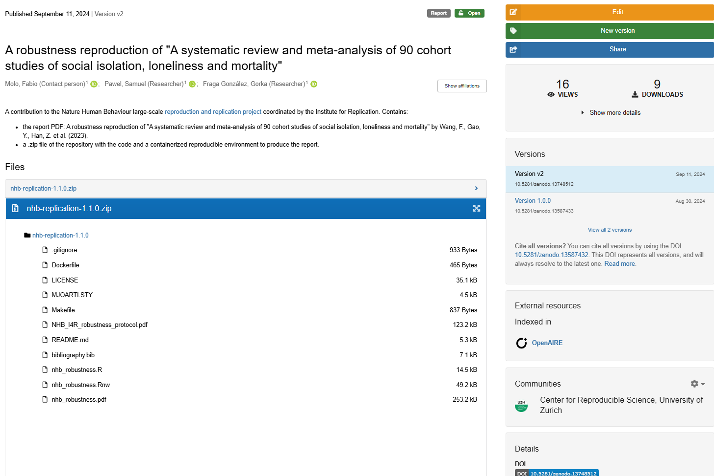

## Sharing scenarios

```{=html}
<style> .font-small {  font-size: 0.8em;} </style>
```

These are some frequent use cases:

1.  `Preliminary results` (temporary, internal reports)
2.  `Internal monitoring`(regularly updated reports)
3.  `Templates or documentation`
4.  `Dissemination` to broader audiences
5.  `Publication` (preprint, dataset, article, etc)

## Git version-controlled repositories

-   [Git](https://git-scm.com/): free and open source distributed version control system
-   Popular platforms: [Gitlab](https://gitlab.com/)(open) and [Github](https://github.com/)(Microsoft)
-   There are `Gitlab instances` at many universities
-   Meant for code and documents, not as data repositories
-   Recommended for `all` sharing scenarios

## Sharing with Gitlab pages

-   [Quarto websites](https://quarto.org/docs/websites/) can easily assemble HTMLs in a website
-   [Gitlab pages](https://docs.gitlab.com/ee/user/project/pages/) can host multiple `static` websites for free
-   They can be `private` or `public`
-   HTML interactivity: e.g., `dashboards`, `plotly`, `DataTables`
-   Example use-cases: sharing results, technical documentation, templates, dissemination, etc

------------------------------------------------------------------------

## Persistent identification

A persistent identifier (e.g., DOI) enable our reports to be `reused` and `found` in time.

Required to make our resources `citable`

#### Where can I get a DOI ?

-   Data repositories (e.g., Zenodo, OSF, Ebrains...)
-   Journals and preprint platforms

------------------------------------------------------------------------

### Popular generalist DOI-enabling repositories

::: fragment
#### [Zenodo](https://zenodo.org/)

-   Free. 50 GB upload limit per dataset (up to 200Gb upon request).
-   Hosted by CERN. The data stays in Switzerland.
:::

::: fragment
#### [Open Science Framework (OSF)](https://osf.io/)

-   Free. Private projects limited to 5 GB and public projects to 50 GB
-   Default storage location in US, but also servers in Canada, Germany and Australia
:::

------------------------------------------------------------------------

## Git repositories and DOIs

-   Gitlab/Github does not offer DOIs
-   'Persistent URLs'/'Permanent links' not as strongly persistent
-   But we can combine a [Gitlab releases](https://docs.gitlab.com/ee/user/project/releases/) with DOI enabling platforms
-   A `release` in Gitlab is a `snapshot` of a repository with
    -   Version tag
    -   Source code and metadata

------------------------------------------------------------------------

### Workflow example with Gitlab and Zenodo {.nostretch}

Robustness check for a Nat. Hum. Behav [initiative](https://www.nature.com/articles/s41562-024-01818-7)

##### [Gitlab Repository](https://gitlab.uzh.ch/crsuzh/nhb-replication)

::: {.column width="50%"}
{fig-align="left" width="491"}
:::

:::: {.column width="50%"}
::: font-small
<br> <br>

Each release includes assets (zipped source code) and a .json with the release metadata

The README.md file has a link to the ZENODO entry with a DOI and citation information.
:::
::::

------------------------------------------------------------------------

##### [Zenodo entry](https://zenodo.org/records/13748512)

::: {.column width="50%"}
{width="500px" fig-align="left"}
:::

::: {.column .font-small width="50%"}
<br><br> A citable Zenodo entry with a DOI and the content of the repository release in a .zip file
:::

------------------------------------------------------------------------

### Preregistration in Open Science Framework (OSF)

-   OSF feature to [preregister](https://help.osf.io/article/145-preregistration) your research plan
-   It can be private and released upon project completion
-   OSF [templates](https://help.osf.io/article/229-select-a-registration-template) can help structure your report
-   Enhances visibility, `rigor and transparency` of your

------------------------------------------------------------------------

<br> <br> Open Science:

> “as open as possible, as closed as necessary”
